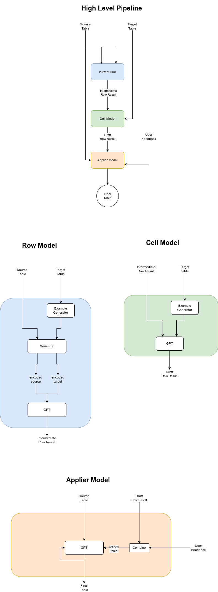

# 🔄 MapGPT

MapGPT is an innovative open-source tool designed to reformat your source table into a desired target format. It intelligently maps values from your source table while adopting column names and value styles/formats from the target table. This tool is incredibly useful for data scientists, analysts, and anyone who works with data in various formats.

## ⚙️ Architecture
### MapGPT Architecture



## 🛠️ How It Works

1. **Column Detection and Pruning**: MapGPT first identifies identical columns in the target table and prunes them, effectively reduces the number of parameters the model needs to manage.

2. **RowModel Creation & Optimization**: The RowModel serves a crucial role in the data transformation process, where it autonomously formulates few-shot prompts by assimilating data from the target table. It initiates this by integrating the first row of the source table as an auxiliary input, subsequently relaying these consolidated data points to the Large Language Model (LLM).

    In an effort to circumvent data hallucination and bolster the precision of its outputs, the model implements a strategic omission of certain cells within these prompts. Empirical data has guided the optimization of this process, leading to the systematic exclusion of approximately 20% of columns and the transformation of 6 rows. This methodology not only challenges but also encourages the model to infer cell-column relationships more effectively.

    Enhancing this approach, the RowModel also incorporates a random shuffling mechanism for the cells. This feature, inspired by the insights from this [research paper](https://arxiv.org/abs/2210.06280), isn't just about adding complexity; it's a calculated tactic to compel the LLM to delve deeper into discerning the underlying correlations between cells and columns. This nuanced shuffling and selective data presentation collectively serve to refine the LLM's comprehension of the data structure, thereby improving the accuracy and integrity of the final output.


3. **CellModel Conversion**: The CellModel takes the intermediate results from the RowModel and converts them into the final row format. This process involves feeding a predetermined number of target rows into the model in the JSON format.

4. **User Feedback**: After generating the final row, MapGPT offers users the option to make any desired changes directly in the UI.

5. **Automated Full-table Transformation**: Based on the user's changes (if any), MapGPT applies the transformation across the entire table. During the generation process, MapGPT handles the tables with large number of rows by iteratively generating the rows. 
Instead of generating at once, MapGPT applies the transformation to the entire table with patches so that the token window limit is not exceeded.
After the generation process, user can then preview the final table before downloading it.

## 🚀 Live Demo

Experience the live demo of MapGPT on our Streamlit app: [MapGPT Streamlit App](https://mapgpt.streamlit.app/)


https://github.com/melih-unsal/MapGPT/assets/34304254/65115924-abd7-445a-a88c-e140ff70c7cd


## 🌟 Features

- Intelligent mapping of table data
- User-driven customization options
- Automated table transformation
- Anti-hallucination and correlation understanding through innovative cell shuffling
- Fine-tuning on the synthetic data and resulting model is ready on the Live Demo

## Approaches 📝
### Pipeline-Related
- **Column Identification**: When the tables are imported, the first thing that MapGPT does is identifying the identical columns. After the identfication, they are removed and not used throughout the pipeline to reduce the token usage. At the end of the processes, the pruned columns are appended in the their correct locations.
- **RowModel**: After the tables are simplified, MapGPT generates single row result to get feedback from the user. To do that, the first model that processes the tables is RowModel which generates the intermediate result. The RowModel serves a crucial role in the data transformation process, where it autonomously formulates few-shot prompts by assimilating data from the target table. To get rid of hallucination and bolster the precision of its outputs, the model implements an omission of columns within these prompts. From the experiments, approximately 20% of columns are removed and the columns are shuffled. This methodology not only challenges but also encourages the model to infer cell-column relationships more effectively. 
For small and big tables, RowModel uses different serializors. For smaller tables, while serializors only include the cells to get rid of creating a strong connection with column names, for bigger tables, column names are appended in the serializor to incrase the model's ability.
- During the experiments, directly assigning the source to target column mapping has been tried. However, even enough number of rows have been shown to the GPT model, the model was not able to generate the mapping correctly. That's why Target Column Modification technique has been implemented.
- **Target Column Modification**: In the Target Column Modification technique, before showing the target table rows to GPT model, the alternative target columns have been generated. With this approach, there has been 2 main benefits gained:
    1. The inappropriate column names have been eliminated to mislead the GPT model.
    2. The connection between the column names and row json keys have been removed during the few shot learning so that GPT model does not search for the exact matching while trying to assing the source row to the target columns.  
- **CellModel**: The CellModel takes the intermediate results coming from the RowModel and converts them into the final row format. To do that, examples are shown to the GPT model to reformat the intermediate result.
- After CellModel generates the result, to get rid of the possible hallucinations, the RowModel result is used as a gate. Since RowModel is also responsible for avoding the hallucinations, the filled columns by CellModel where the corresponding cells were empty bebore are not accepted by RowModel. 
- **Experimental Models**: In the experiments, Paragraph to JSON and JSON to Paragraph Models have been implemented. Those models are able to convert between natural language and JSON representation. Those models have been used to refine the result of the CellModel. Since in the RowModel, to get rid of the hallucinations, random pruning and shuffling has been applied, to get rid of extra safeness, refiner model was free to fill out the empty cells which are resctiricted by the RowModel. However, this modules has been removed from the pipliene till enough number of experiments is conducted.  
- In another experiment, since column to column mapping was non-trivial task and incompatible column-cells might occur, instead of column-column mapping, cell to cell mapping has been tried. From those mappings, column to column mapping is generated. 
- For all approaches there has been lots of hyperparameter optimization made including column pruning parameter, serializor approahces etc.
- FeedbackRowModel has been experimented for directly getting feedback for column mapping refining from the user. Since vanilla column to column hadn't passed the tests, it has been removed from the pipeline.
- LangSmith has been integrated to speed up the experiments. 
- After CellModel generates the single row result, it is shown to the user. Then after the user gives feedback, the taken feedback is seen as a ground truth and according to it, the remaining rows are generated by few shot learning. Not to exceed the token limit, one shot learning with iterative generation has been applied. During the generation of the tables, instead of using the generated rows as an input in the next generation, to make it more token effecive, they are not used. The reason is, during the experiments, its effect was not enough to increase the token usage that much. 
- In another experiment, instead of random shuffling and removing the columns, LLM-based JSON2Paragraph model has been implemented and as a result, these generated paragraphs are used as an input and JSONs made as a target during the few shot learning stage. By this methodology, the paragraphs were not explicitly including the actual keys but values from the source JSON. After those paragraphs have been generated for the target table, single paragraph is generated for source table while single paragraph from target table has been shown to LLM for One-Show Learning purpose. By showing all those paragraph,JSON pairs, resulting JSON is reqested from the LLM in the RowModel and it is observed that it is more performant than before. 
- In another experiment, after the RowModel generated the draft result, to add the style from the target table, CellModel has been modified to preserve the style better. To do that, LLM is requested to find the patterns of the resulting JSON in TargetTablePatternFinderModel. In this model, LLM generates the patterns found from multiple JSONs for each key. Then, TargetTablePatternApplierModel was finalizing the single row result by applying the generated pattern by TargetTablePatternFinderModel to the result of RowModel.  
### Fine Tuning
- **Data Preparation**: To start the data preperation, 14 tables have been generated using ChatGPT. In this process, the tables had been generated pair by pair and the rows in the same line are compatible with each other. This property has been intentionally made to accelerate the preprocessing and augmentation of the data.
- After the table pairs are generated, 2 tables are generated which correspond to the source2target and target2source tables to increase the number of data points (source2target and target2source tables are the expected results when the user tries to reformat the source table to target table or target table to source table respecrively). In those tables, to increase the variety and get rid of the column-wise exact match (in terms of the number of colummns), extra columns have been generated.
- **Column Mapping Generation**: After the tables are finalized, column mapping data has been generated. To simplify this process, only one way mapping (source to target table) has been generated and the other was has been automatically generated.
- **Column Modifications**:  To convert the data into finetunable data, random column pruning has been applied. With the predetermined probability, 30% of the column have been deleted and according to the column mapping and deleted columns, the corresponding cells are had been modified. This shows the model that no 1 to 1 matchin is expected.
- After the random column pruning, columns are randomly shufled by 5% probability. This is made for the cases where the column names are wrong so that the model becomes aware that the crucial part is the style instead of semantic similarity of the column names.
- To remove the column order relationship, all columns are shuffled.
- **Fine-tuning Input Data**: At the end of the data preparation process, the input data included single row as a JSON and 3 randomly selected row examples to predict the target row. The reason why 3 examples instead of 1 is selected is that, for humans, seeing a single target row example is not enough to predict each cell especially for the categorical columns. That's why, during the inference, the model also sees 3 row examples from the target row. In the inference, different number of examples are also tried and the number of examples is not mandatory to be 3 but could be 2 or even more than 3.
### Planned Approaches (For Further Experiments)
- **LLM-based Serializor Integration**: In the RowModel, to decrease the overall token usage, the selected serializor is inspired from the [research paper](https://arxiv.org/abs/2210.06280) to decrease the number of token usage. However, it is worth to experiment LLM-based serializor such as applying JSON2Paragraph and Paragraph2JSON Models before inputting the RowModel to increase the accuracy of the RowModel phase. 
- In CellModel, target rows are shown to the model so as to decrease the token usage. However, using LLM-based serializor for showing examples is planned to be used.
- **Embedding Based Column Mapping**: After column names are modified with ColumnRenamer model, a matrix of size mxn where m and n are the source column count and target column count respectively. The matrix[i,j] will correspond to the distance between source column i and target column j by showing k cells in source column i and k cells in target column j in addition to the name of the source column i and target column j. By enough number of experiments, the correct threshold will be found and according to the distances, the first column mapping will be generated and according this mapping, the first result will be ready before RowModel. This result will be helpful to produce the correct result for RowModel.
- **Column Seperator**: Since not all the column are similar in terms of data type and variety, it is good idea to group those target columns at the beginning. After lots of experiments, it is seen that, the hardest column for MapGPT is the one having different possible cells of type string (greater than 5) but also not free in terms of the possible values. For those columns, it is not fully accurate to show couple of rows to to LLM to give the final decision for that cell because of this limitation. To get rid of this problem, those columns will be detected at the beginning and will be seperated from the table till the end. After all other columns are generated, those columns will be generated by providing all other cells to the Embedding Model then the closest choice will be selected from the available options. In that case, it will be guarenteed that only the available options are selected instead of LLM-generated free output.
- **Self-Refining Strategy**: Self-refining strategy for each CellModel result is planned. Since LLMs are good at generating feedback to itself, it is worth to experiment Self-Refining strategy before showing the first result to the user. Here, after CellModel generates the draft row result, Self-Refining technique could be applied to get the missing or hallucinated parts compared to the draft result and according to the feedback, new row can be generated.
- **Categorical Column Awareness**: Showing the categorical columns with their contents to the GPT to make it aware that only those values are possible for the specific column.
- **Handling Large Tables**: For larger tables (having more than 200 columns) enabling MapGPT to generate the rows by column patches not to exceed the token usage.
- **Data Augmentation**: It is planned to increase the number of data pairs and column amounts.

## 💾 Installation

```bash
git clone git@github.com:melih-unsal/MapGPT.git
cd MapGPT
pip install -r requirements.txt
```

## Usage 🖥️

To run the app, use the following command:

```bash
streamlit run app.py
```

## 🔬 Experiments

During the development of MapGPT, various models and approaches were experimented with, refining the process and outcomes. Here are some of the significant experiments conducted:

- **RefinerModel**: In one experimental approach, the intermediate single row result generated by the CellModel was further refined using the RefinerModel, which consists of two sub-models: Paragraph2JsonModel and Json2ParagraphModel. These sub-models converted paragraphs to JSON and vice versa. Although this method filled some needed cells, the process was relatively slow due to back-to-back API calls and thus was not included in the final pipeline.

- **ColumnMappingsModel**: This model attempted column-to-column mapping using single row JSONs. While value mapping was successful, small typos caused the column mapping to perform poorly in tests with various table pairs. As a result, this model was excluded from the final pipeline.

- **FeedbackCellModel**: Initially, users could only provide feedback on column mapping. The FeedbackCellModel was used to refine row results based on this input. However, for ease of use, the feedback system was adjusted to allow users to directly modify the generated single row result on the original dataframe.

- **LLM-Based Serialization**: During the experiments, JSON2Paragraph has been used to serialize the rows into natural language. During this serialization, target table rows have been converted to paragraphs by not explicitly mentioning the column names to get rid of the strong correlation between the cells and the columns. Then, source table row has been coverted to paragraph by giving one of the generated paragraphs from target to table to mimic the style of the target row - paragraph transformation for the One-Shot Learning. This serialization has significantly outperformed the standard RowModel during the comparison tests.

## To-Do 📝
- [x] Target Column Modification for get rid of exact match search in RowModel
- [x] Source to Target column mapping
- [x] Paragraph to JSON
- [x] JSON to Paragraph
- [x] Using Paragraph to JSON and JSON to Paragraph models, refine the CellModel result using the transformation from paragraph to json in target row as an example, apply it on the source row. 
- [x] Column mapping via Cell to Cells
- [x] Hyperparameter optimization for few shot learning example count, randomization parameters in RowModel
- [x] FeedbackRowModel for directly getting feedback for column mapping refining
- [x] Model selection (**Streamlit**)
- [x] Editable intermediate result (**Streamlit**)
- [x] Editable Final Result (**Streamlit**)
- [x] Download button (**Streamlit**)
- [x] LangSmith integration (**LangChain**)
- [x] random column shuffle (to get rid of hallucination) (**RowModel**)
- [x] random column removal (to get rid of hallucination) (**RowModel**)
- [x] Different decoder usage for small and big tables (according to the column size) (**RowModel**)
- [x] generated examples (**CellModel**)
- [x] By using RowModel result as a gate for CellModel result get rid of possible hallucinations coming from CellModel (**ApplierModel**)
- [x] Iterative generation not to exceed the token limit (**ApplierModel**)
- [x] From single row result, apply one shot learning for efficient token usage (**ApplierModel**)
- [x] Initial table pair prepared (14 pairs) (**Fine-tuning**)
- [x] Data cleaning for source to target table transformation data (**Fine-tuning**)
- [x] Column Mapping data preparation (**Fine-tuning**)
- [x] Random column deleting (**Fine-tuning**)
- [x] Column shuffling without changing the row orders to force the model to learn only the styles of the row rather than generating strongly based on column names  (**Fine-tuning**)
- [x] Adding extra columns to the tables to make the model be aware of the fact that the same cell could be usable by the multiple columns in the target (**Fine-tuning**)
- [x] use the same data in 2 ways (both source to target and target to source) (**Fine-tuning**)
- [x] Trying column transformation in target table at the beginning.
- [x] In CellModel, use gpt-based textual encoder for showing examples
- [ ] Give some of the unique elements for each column during the generation of the rest of the rows
- [ ] For larger tables (having more than 200 columns) generate the rows patch by patch
- [ ] Fine-tune on the larger dataset.

## 🤝 Contribute

Contributions to the MapGPT project are welcomed! Whether you're fixing bugs, improving the documentation, or proposing new features, your efforts are highly appreciated. Please check the open issues before starting any work.

> Please read [`CONTRIBUTING`](CONTRIBUTING.md) for details on our [`CODE OF CONDUCT`](CODE_OF_CONDUCT.md), and the process for submitting pull requests to us.

## 📜 License

MapGPT is an open-source project licensed under [MIT License](LICENSE).

---

For any issues, questions, or comments, please feel free to contact us or open an issue. We appreciate your feedback to make MapGPT better.
