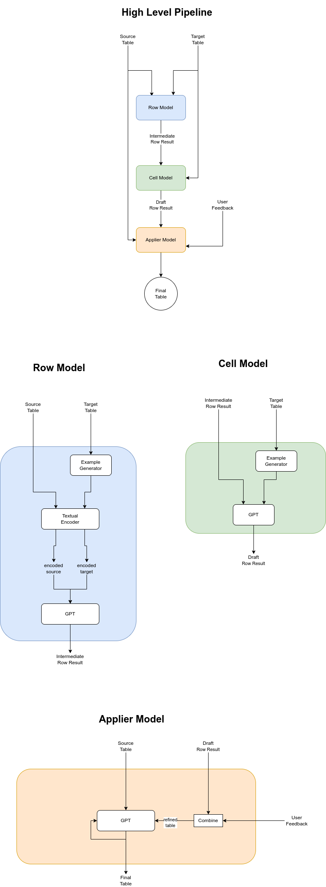

# 🔄 MapGPT

MapGPT is an innovative open-source tool designed to reformat your source table into a desired target format. It intelligently maps values from your source table while adopting column names and value styles/formats from the target table. This tool is incredibly useful for data scientists, analysts, and anyone who works with data in various formats.

## ⚙️ Architecture
### MapGPT Architecture



## 🛠️ How It Works

1. **Column Detection and Pruning**: MapGPT first identifies identical columns in the target table and prunes them, effectively reduces the number of parameters the model needs to manage.

2. **RowModel Creation & Optimization**: The RowModel serves a crucial role in the data transformation process, where it autonomously formulates few-shot prompts by assimilating data from the target table. It initiates this by integrating the first row of the source table as an auxiliary input, subsequently relaying these consolidated data points to the Large Language Model (LLM).

    In an effort to circumvent data hallucination and bolster the precision of its outputs, the model implements a strategic omission of certain cells within these prompts. Empirical data has guided the optimization of this process, leading to the systematic exclusion of approximately 20% of columns and the transformation of 6 rows. This methodology not only challenges but also encourages the model to infer cell-column relationships more effectively.

    Enhancing this approach, the RowModel also incorporates a random shuffling mechanism for the cells. This feature, inspired by the insights from this [research paper](https://arxiv.org/abs/2210.06280), isn't just about adding complexity; it's a calculated tactic to compel the LLM to delve deeper into discerning the underlying correlations between cells and columns. This nuanced shuffling and selective data presentation collectively serve to refine the LLM's comprehension of the data structure, thereby improving the accuracy and integrity of the final output.


3. **CellModel Conversion**: The CellModel takes the intermediate results from the RowModel and converts them into the final row format. This process involves feeding a predetermined number of target rows into the model in the JSON format.

4. **User Feedback**: After generating the final row, MapGPT offers users the option to make any desired changes directly in the UI.

5. **Automated Full-table Transformation**: Based on the user's changes (if any), MapGPT applies the transformation across the entire table. During the generation process, MapGPT handles the tables with large number of rows by iteratively generating the rows. 
Instead of generating at once, MapGPT applies the transformation to the entire table with patches so that the token window limit is not exceeded.
After the generation process, user can then preview the final table before downloading it.

## 🚀 Live Demo

Experience the live demo of MapGPT on our Streamlit app: [MapGPT Streamlit App](https://mapgpt.streamlit.app/)

## 🌟 Features

- Intelligent mapping of table data
- User-driven customization options
- Automated table transformation
- Anti-hallucination and correlation understanding through innovative cell shuffling
- Fine-tuning on the synthetic data and resulting model is ready on the Live Demo

## 💾 Installation

```bash
git clone git@github.com:melih-unsal/MapGPT.git
cd MapGPT
pip install -r requirements.txt
```

## Usage 🖥️

To run the app, use the following command:

```bash
streamlit run app.py
```

## 🔬 Experiments

During the development of MapGPT, various models and approaches were experimented with, refining the process and outcomes. Here are some of the significant experiments conducted:

- **RefinerModel**: In one experimental approach, the intermediate single row result generated by the CellModel was further refined using the RefinerModel, which consists of two sub-models: Paragraph2JsonModel and Json2ParagraphModel. These sub-models converted paragraphs to JSON and vice versa. Although this method filled some needed cells, the process was relatively slow due to back-to-back API calls and thus was not included in the final pipeline.

- **ColumnMappingsModel**: This model attempted column-to-column mapping using single row JSONs. While value mapping was successful, small typos caused the column mapping to perform poorly in tests with various table pairs. As a result, this model was excluded from the final pipeline.

- **FeedbackCellModel**: Initially, users could only provide feedback on column mapping. The FeedbackCellModel was used to refine row results based on this input. However, for ease of use, the feedback system was adjusted to allow users to directly modify the generated single row result on the original dataframe.

## To-Do 📝
- [x] Target Column Modification for get rid of exact match search in RowModel
- [x] Source to Target column mapping
- [x] Paragraph to JSON
- [x] JSON to Paragraph
- [x] Using Paragraph to JSON and JSON to Paragraph models, refine the CellModel result using the transformation from paragraph to json in target row as an example, apply it on the source row. 
- [x] Column mapping via Cell to Cells
- [x] Hyperparameter optimization for few shot learning example count, randomization parameters in RowModel
- [x] FeedbackRowModel for directly getting feedback for column mapping refining
- [x] Model selection (**Streamlit**)
- [x] Editable intermediate result (**Streamlit**)
- [x] Editable Final Result (**Streamlit**)
- [x] Download button (**Streamlit**)
- [x] random column shuffle (to get rid of hallucination) (**RowModel**)
- [x] random column removal (to get rid of hallucination) (**RowModel**)
- [x] Different decoder usage for small and big tables (according to the column size) (**RowModel**)
- [x] generated examples (**CellModel**)
- [x] By using RowModel result as a gate for CellModel result get rid of possible hallucinations coming from CellModel (**ApplierModel**)
- [x] Iterative generation not to exceed the token limit (**ApplierModel**)
- [x] From single row result, apply one shot learning for efficient token usage (**ApplierModel**)
- [x] Initial table pair prepared (14 pairs) (**Fine-tuning**)
- [x] Data cleaning for source to target table transformation data (**Fine-tuning**)
- [x] Column Mapping data preparation (**Fine-tuning**)
- [x] Random column deleting (**Fine-tuning**)
- [x] Column shuffling without changing the row orders to force the model to learn only the styles of the row rather than generating strongly based on column names  (**Fine-tuning**)
- [x] Adding extra columns to the tables to make the model be aware of the fact that the same cell could be usable by the multiple columns in the target (**Fine-tuning**)
- [x] use the same data in 2 ways (both source to target and target to source) (**Fine-tuning**)
- [ ] Trying column transformation in target table at the beginning.
- [ ] In CellModel, use gpt-based textual encoder for showing examples
- [ ] Give some of the unique elements for each column during the generation of the rest of the rows
- [ ] For larger tables (having more than 200 columns) generate the rows patch by patch
- [ ] Fine-tune on the larger dataset.

## 🤝 Contribute

Contributions to the DemoGPT project are welcomed! Whether you're fixing bugs, improving the documentation, or proposing new features, your efforts are highly appreciated. Please check the open issues before starting any work.

> Please read [`CONTRIBUTING`](CONTRIBUTING.md) for details on our [`CODE OF CONDUCT`](CODE_OF_CONDUCT.md), and the process for submitting pull requests to us.

## 📜 License

MapGPT is an open-source project licensed under [MIT License](LICENSE).

---

For any issues, questions, or comments, please feel free to contact us or open an issue. We appreciate your feedback to make MapGPT better.
